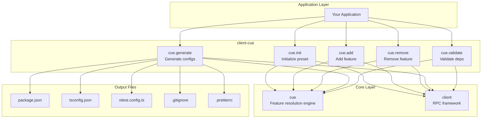
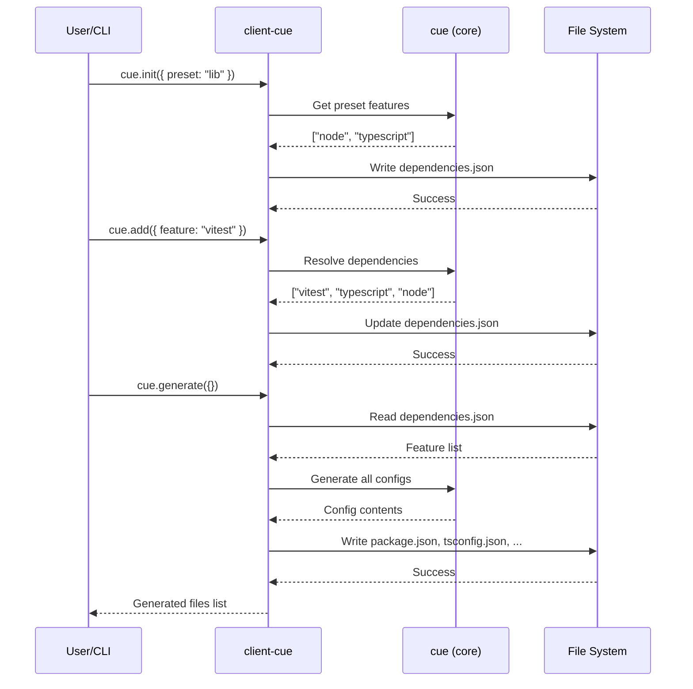
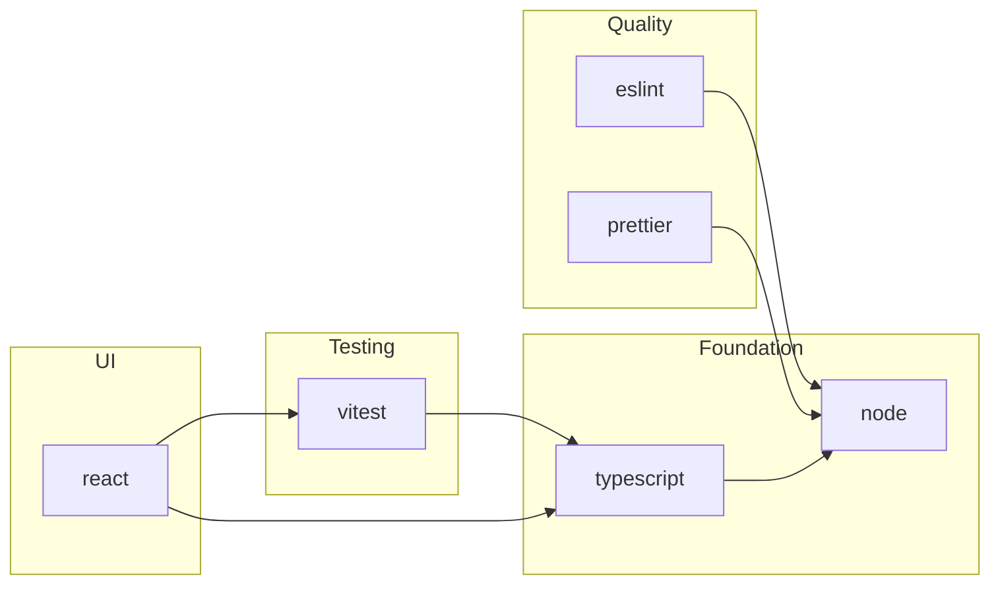
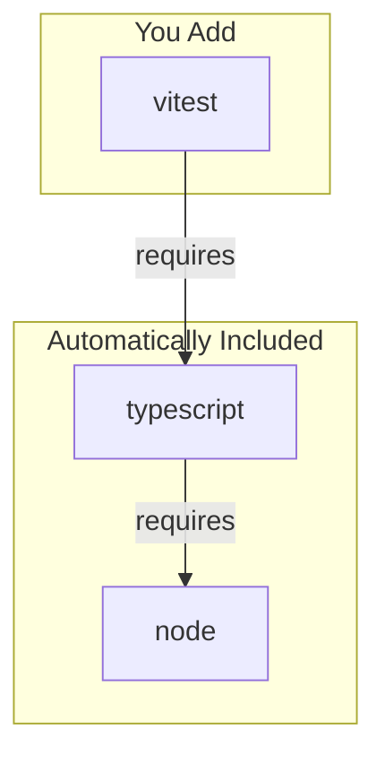
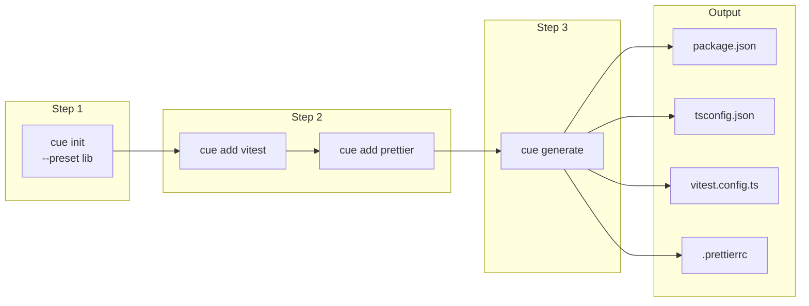
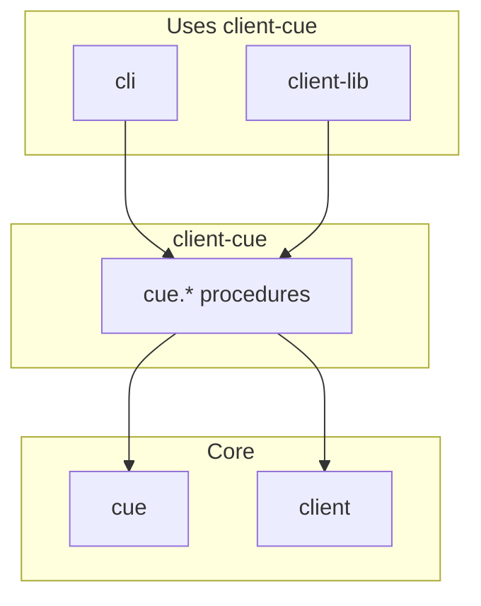

# @mark1russell7/client-cue

[](https://opensource.org/licenses/MIT)
[](https://www.typescriptlang.org/)
[](https://nodejs.org/)

> CUE-based configuration management as RPC procedures. Initialize, add/remove features, and generate config files declaratively.

## Table of Contents

- [Overview](#overview)
- [Installation](#installation)
- [Architecture](#architecture)
- [Quick Start](#quick-start)
- [API Reference](#api-reference)
  - [cue.init](#cueinit)
  - [cue.add](#cueadd)
  - [cue.remove](#cueremove)
  - [cue.generate](#cuegenerate)
  - [cue.validate](#cuevalidate)
- [Feature System](#feature-system)
- [Workflow](#workflow)
- [Integration](#integration)
- [Requirements](#requirements)
- [License](#license)

---

## Overview

**client-cue** provides procedures for declarative configuration management:

- **Preset Initialization** - Start projects with feature presets (lib, app, react, node)
- **Feature Management** - Add/remove features with automatic dependency resolution
- **Config Generation** - Generate package.json, tsconfig.json, vitest.config.ts, etc.
- **Validation** - Validate dependencies.json against feature manifests

---

## Installation

```bash
npm install github:mark1russell7/client-cue#main
```

---

## Architecture

### System Overview



### Configuration Generation Flow



### Feature Dependency Graph



---

## Quick Start

```typescript
import { Client } from "@mark1russell7/client";
import "@mark1russell7/client-cue/register";

const client = new Client({ /* transport */ });

// Initialize configuration with a preset
await client.call(["cue", "init"], {
  preset: "lib",
  cwd: "/path/to/project",
});

// Add a feature
await client.call(["cue", "add"], {
  feature: "vitest",
});

// Generate config files
await client.call(["cue", "generate"], {});
```

---

## API Reference

### Procedures Summary

| Path | Description |
|------|-------------|
| `cue.init` | Initialize dependencies.json with a preset |
| `cue.add` | Add a feature to dependencies |
| `cue.remove` | Remove a feature from dependencies |
| `cue.generate` | Generate config files from dependencies |
| `cue.validate` | Validate dependencies.json |

---

### cue.init

Initialize `dependencies.json` with a preset.

```typescript
interface CueInitInput {
  preset?: string;       // Preset name (default: "lib")
  force?: boolean;       // Overwrite existing (default: false)
  cwd?: string;          // Working directory
}

interface CueInitOutput {
  success: boolean;
  preset: string;
  created: string[];     // Files created
  message?: string;
  error?: string;
}
```

**Available Presets:**

| Preset | Features Included |
|--------|-------------------|
| `lib` | node, typescript |
| `app` | node, typescript, vitest, eslint, prettier |
| `react` | node, typescript, react, vitest, eslint, prettier |
| `node` | node, typescript, vitest |

**Example:**
```typescript
await client.call(["cue", "init"], {
  preset: "lib",
  cwd: "/my/project",
});
// Creates dependencies.json with lib features
```

---

### cue.add

Add a feature to dependencies.json.

```typescript
interface CueAddInput {
  feature: string;       // Feature to add
  cwd?: string;          // Working directory
}

interface CueAddOutput {
  success: boolean;
  feature: string;
  added: boolean;        // false if already present
  message?: string;
  error?: string;
}
```

**Available Features:**

| Feature | Description | Dependencies |
|---------|-------------|--------------|
| `node` | Node.js runtime | - |
| `typescript` | TypeScript support | node |
| `vitest` | Vitest testing framework | typescript |
| `prettier` | Code formatting | node |
| `eslint` | Code linting | node |
| `react` | React framework | typescript, vitest |
| `client` | Mark client procedures | typescript |

**Example:**
```typescript
await client.call(["cue", "add"], {
  feature: "vitest",
});
// Adds vitest and its dependencies (typescript, node) to dependencies.json
```

---

### cue.remove

Remove a feature from dependencies.json.

```typescript
interface CueRemoveInput {
  feature: string;       // Feature to remove
  cwd?: string;          // Working directory
}

interface CueRemoveOutput {
  success: boolean;
  feature: string;
  removed: boolean;      // false if not present
  message?: string;
  error?: string;
}
```

**Example:**
```typescript
await client.call(["cue", "remove"], {
  feature: "eslint",
});
```

---

### cue.generate

Generate configuration files from dependencies.json.

```typescript
interface CueGenerateInput {
  cwd?: string;          // Working directory
}

interface CueGenerateOutput {
  success: boolean;
  resolvedFeatures: string[];  // All resolved features
  generated: string[];         // Files generated
  message?: string;
  error?: string;
}
```

**Generated Files:**

| File | Generated When |
|------|----------------|
| `package.json` | Always |
| `tsconfig.json` | typescript feature |
| `vitest.config.ts` | vitest feature |
| `.gitignore` | Always |
| `.prettierrc` | prettier feature |
| `.eslintrc.js` | eslint feature |

**Example:**
```typescript
const result = await client.call(["cue", "generate"], {});
console.log(`Generated: ${result.generated.join(", ")}`);
```

---

### cue.validate

Validate dependencies.json against the feature manifest.

```typescript
interface CueValidateInput {
  cwd?: string;          // Working directory
}

interface CueValidateOutput {
  success: boolean;
  valid: boolean;
  features: string[];    // Declared features
  errors: string[];      // Validation errors
  message?: string;
}
```

**Example:**
```typescript
const result = await client.call(["cue", "validate"], {});
if (!result.valid) {
  console.error("Validation errors:", result.errors);
}
```

---

## Feature System

### dependencies.json Format

```json
{
  "$schema": "https://mark1russell7.github.io/cue/schema.json",
  "dependencies": [
    "typescript",
    "vitest",
    "prettier"
  ]
}
```

### Automatic Dependency Resolution

When you add a feature, its dependencies are automatically included:



---

## Workflow

### Typical Project Setup



### CLI Workflow

```bash
# Step 1: Initialize with preset
npx cue-config init --preset lib

# Step 2: Add features
npx cue-config add vitest
npx cue-config add prettier

# Step 3: Generate configs
npx cue-config generate

# Validate anytime
npx cue-config validate
```

---

## Integration

### With CLI

```bash
# The mark CLI uses client-cue internally
mark lib new my-package  # Calls cue.init + cue.generate
```

### With MCP (Claude)

When using the MCP server, Claude can:
- Initialize projects: "Create a new TypeScript library"
- Add features: "Add vitest to this project"
- Generate configs: "Regenerate the config files"

### With Other Packages



---

## Requirements

- **Node.js** >= 20
- **Dependencies:**
  - `@mark1russell7/client`
  - `@mark1russell7/cue`

---

## License

MIT
